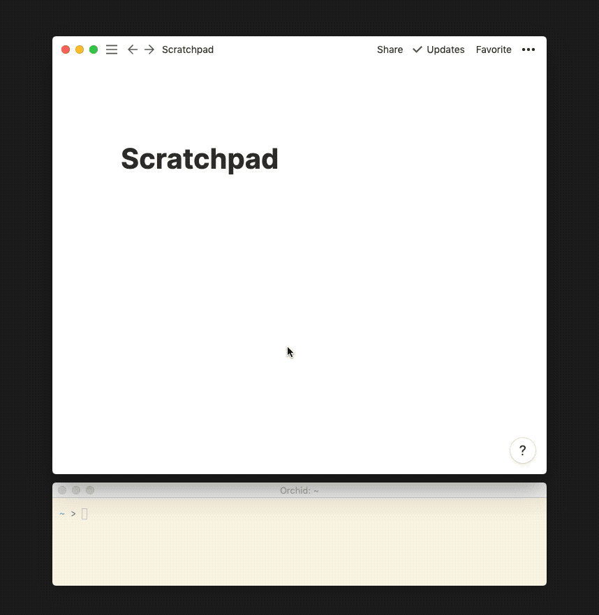

# `drop-cli`

Synthetic drag&drop cli tool.



Useful in combination with a keybinding tool (I use [Hammerspoon](http://hammerspoon.org/)), and situations when you might not want to drag stuff around, and paste doesn't seem to work - Figma, Notion, Slack - looking at you. In macOS you can also drop folder/file on open/save pane to get to it.

In Hammerspoon I have a key bound to getting current path from clipboard, and `drop-cli`-ing it:

```lua
-- force drop
hs.hotkey.bind({ "ctrl", "cmd" }, "d", function()
  local path = hs.pasteboard.getContents()
  hs.execute("drop-cli " .. path, true)
end)
```

## Building

Either through `Xcode` or `./compile.sh`.

## Usage

Place your mouse over a drop target and run `drop-cli path_to_file.png` or `drop-cli http://some-hosted-file.png` (URLs are first downloaded before being dropped - useful for google images).

`drop-cli` will generate synthetic drop event at current mouse position.

## Acknowledgments

- inspired by/adapted from [`drag`](https://github.com/natestedman/drag)
- thanks to [Kevin Lynagh](https://kevinlynagh.com/) for making me accountable to build this :)

